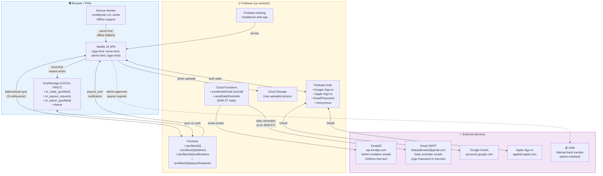

# MyDailyWin — Data Flow Architecture

> Gamified habit tracker with points, streaks, multi-profile admin, and manual Zelle payouts.

## Platform Summary

| Layer | Service |
|-------|---------|
| **Hosting** | Firebase Hosting (`mydailywin.web.app`) |
| **Database** | Firebase Firestore (profiles, admins, notifications, payoutRequests) |
| **Auth** | Firebase Auth (Google, Apple, email/password, anonymous) |
| **Storage** | Firebase Cloud Storage (user-uploaded photos) |
| **Serverless** | Firebase Cloud Functions (Node.js 22, us-central1) |
| **Email** | EmailJS (admin invites, 200/mo free) + Gmail SMTP (daily reminders via Cloud Function) |
| **Client Storage** | localStorage (local-first state, synced to Firestore when authenticated) |
| **Payments** | Manual Zelle (admin-initiated, not automated) |
| **PWA** | Service Worker (`mydailywin-v11` cache, offline support) |

## Data Flow

## Key Data Flows

1. **Task Completion**: User marks task → localStorage (instant) → points recalculated → Firestore sync (2s debounce)
2. **Payout Request**: User requests cashout → localStorage + Firestore → admin reviews → manual Zelle → Firestore notification → user sees confirmation
3. **Admin Invite**: Admin enters email → Cloud Function `sendInviteEmail` → EmailJS API → email sent → recipient signs in → Firestore admin subcollection checked
4. **Daily Reminder**: Cloud Scheduler → `sendDailyReminder` function (8AM ET) → Gmail SMTP → hardcoded recipients
5. **Cloud Sync**: Auth state change → `loadFromCloud()` → merge local + cloud state → bidirectional sync
